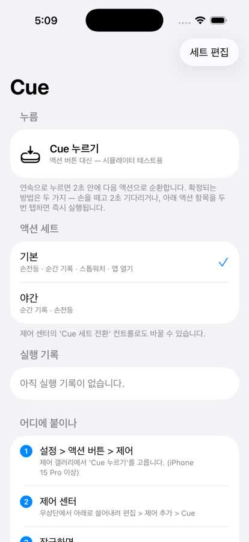
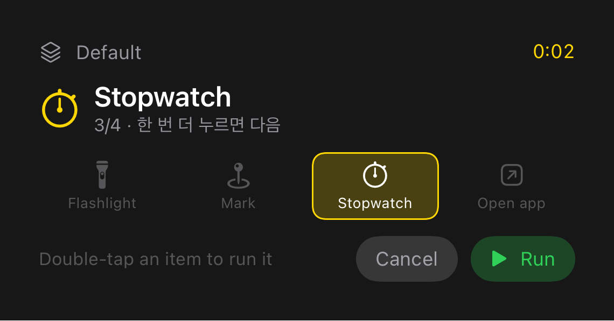

# Cue — design notes

*[한국어](DESIGN.ko.md) · Overview: [README.md](README.md)*

What was built is in the README. This file holds **why it was built that way**, and what
actually broke on the way there.

- [One AppIntent, five surfaces](#one-appintent-five-surfaces)
- [Layout](#layout)
- [Telling cycling and double-tap apart](#telling-cycling-and-double-tap-apart)
- [The commit wait — moved out of the intent](#the-commit-wait--moved-out-of-the-intent)
- [Opening the app from the card](#opening-the-app-from-the-card)
- [Polling app state](#polling-app-state)
- [Why opening is a separate intent](#why-opening-is-a-separate-intent)
- [Store bootstrap](#store-bootstrap)
- [Haptics](#haptics)
- [Concurrency](#concurrency)
- [Localization](#localization)
- [Test layers](#test-layers)
- [Verification status](#verification-status)
- [Known limits](#known-limits)
- [What to do next](#what-to-do-next)

## One AppIntent, five surfaces

One `CuePressIntent` runs from five places.

```
CuePressIntent  (LiveActivityIntent)
  ├─ Control Center control
  ├─ Action button
  ├─ Lock Screen control
  ├─ Buttons inside the Live Activity / Dynamic Island
  └─ Siri · Shortcuts
```

One `ControlWidget` (`CuePressControl`) appears in Control Center, on the Lock Screen and
on the **Action button**. The user picks where. From watchOS 26 the same control also shows
up in Watch Control Center and on the Watch Ultra's Action button.

Adopting `LiveActivityIntent` is what lets it start a Live Activity while the app is not
in the foreground.

## Layout

```
Cue/
├── Cue.xcodeproj                        hand-written, no generator
├── Shared/                              compiled into both app and widget extension
│   ├── CueModels.swift                    actions · sets · runtime state · log · CueURL
│   ├── CueStore.swift                     App Group UserDefaults · invalidation token
│   ├── CueAttributes.swift                ActivityAttributes
│   ├── CueEngine.swift                  ★ cycle / commit state machine
│   ├── CueActionRunner.swift              action execution
│   ├── CuePresenting.swift                presentation protocol (test seam)
│   ├── CueLiveActivityController.swift    the only real CuePresenting
│   ├── CueActivityViews.swift             Live Activity · DI views (renderable in tests)
│   ├── CueHaptics.swift                   cycle · commit haptics
│   ├── CueIdentifiers.swift               accessibilityIdentifiers for UI automation
│   ├── CueIntents.swift                   7 intents + AppShortcutsProvider
│   └── Localizable.xcstrings              ko (source) · en
├── Cue/                                 app target
│   ├── CueApp.swift
│   ├── ContentView.swift                  press test · set picker · history · setup guide
│   ├── SetEditorView.swift
│   └── CueViewModel.swift
├── CueWidgets/                          widget extension target
│   ├── CueWidgetsBundle.swift
│   ├── CueLiveActivity.swift              ActivityConfiguration wiring only
│   └── CueControls.swift                  2 controls
├── CueTests/                            unit test target
│   ├── CueTestHarness.swift               SpyPresenter + isolated store
│   ├── CueEngineTests.swift               state machine, 32
│   └── CueActivityViewTests.swift         view render · presentation rules, 14
└── CueUITests/                          integration smoke (XCUITest)
    └── CueSmokeUITests.swift              wiring · localization, 5 (ko · en)
```

| | |
|---|---|
| App bundle ID | `com.keen.cue` |
| Extension bundle ID | `com.keen.cue.widgets` |
| App Group | `group.com.keen.cue` |

## Telling cycling and double-tap apart

Every Action button press and every item tap is a **separate intent invocation**. Nothing
guarantees the process survives between them, so "what the last input was" is read from
values left in the App Group — `lastPressAt`, `lastInputWasItemTap`, `generation`.

| Input | Decision |
|---|---|
| Action button / control (`press`) | Window open → next item, otherwise item 0 |
| First tap on an item (`tapItem`) | Move the selection there and reopen the window |
| Second tap on the same item | `lastInputWasItemTap && selectedIndex == index && in window` → commit now |

Taps carry the **action's UUID, not its index**. A card is a snapshot of the moment it was
made; if the set changed since, the same index points at a different action. When the
identifier is not found, nothing happens — better than running something other than what
was on screen.

Buttons in a Live Activity deliver **single taps only** — there is no double-tap gesture.
So two single taps are classified by the rule above. The in-app strip goes through the same
`CueSelectIntent` → `CueEngine.tapItem` path, so the behaviour is identical everywhere.

`press()` and `tapItem()` both converge on `arm(index:isItemTap:set:)`. Moving the
selection, showing the Live Activity, waiting for the window and committing exist in
exactly one place.

### `generation` is a monotonic invalidation token

`arm()` captures `generation` before sleeping and commits only if the value is unchanged
when it wakes. So **every path that means to invalidate a pending wait must raise it.**
Three things go wrong when that contract breaks.

| How it breaks | Result |
|---|---|
| Confirming without raising it | The sleeping task passes its check and runs **the same action twice** |
| Resetting it (assigning `CueState.empty`) | Collides with a later press's value — double execution again |
| Not raising it on a config change | A stale index points at **a different action in the new set** |

So the single place that raises it is `CueStore.disarm()`. `commit()`, `cancel()` and
`nextSet()` all go through it, and the UI paths that change configuration (`selectSet`,
`update`) call `CueEngine.invalidateCycleIfArmed()`. Clearing runtime state uses
`CueStore.clearRuntimeState()` instead of assigning `CueState.empty`, so the counter
carries forward.

All three have regression tests, and **each fix was reverted to confirm the test fails.**
With the first two broken together, even `invalidateCycleIfArmed()` was defeated and an
action from another set ran.

## The commit wait — moved out of the intent

**At first the wait was a `Task.sleep(2s)` inside `perform()`.** The thinking was that an
intent's process can be suspended once it returns, so returning late keeps it alive until
execution. It fell over on device — only the first card appeared; cycling and auto-commit
were both dead.

The cause was not the execution budget. App Intents get 30 seconds. **Re-entrancy was the
problem.** The Action button does not deliver the next press while a previous run is still
going (undocumented, but widely confirmed). Holding on for 2 seconds means every press
inside those 2 seconds is swallowed by the system, which is the premise cycling rests on.

Now the intent writes state, shows the card, and **returns immediately**. The commit belongs
to `CueCommitScheduling` — the app-target implementation takes a
`UIApplication.beginBackgroundTask` grace period and calls
`CueEngine.commitIfCurrent(generation:)` once the window closes. `generation` still serves as
the invalidation token: if more input arrived meanwhile the value differs and the reservation
retires quietly.

Taking the assertion **synchronously, before scheduling** matters. Grab it after spawning the
`Task` and the process can suspend in between. On expiration the reservation is dropped
rather than run late — better than the torch coming on after the user has forgotten about it.

`UIApplication` is unavailable in app extensions, so the implementation lives in the app
target and is injected at launch. The default implementation in `Shared/` takes no grace
period — it is for the foreground and for tests.

If a card gets stuck in `.cycling`, `commitAt` is permanently in the past. Building
`Date()...commitAt` from that traps (`Range requires lowerBound <= upperBound`), so the
countdown goes through `ContentState.remainingCountdown(now:)`, which returns `nil` once
the moment has passed and falls back to the position label. The clock is read once and
used for both the comparison and the range.

**This is not an absolute guarantee either.** `beginBackgroundTask` requests a grace period;
it does not promise execution. iOS has no API that guarantees "local hardware action exactly
2 seconds from now." That is why the Live Activity carries **Run / Cancel** buttons and why
**double-tapping an item** exists. If the auto-commit falls over, the other paths remain.

## Opening the app from the card

**An intent cannot do it.** The first attempt put intents with `openAppWhenRun = true` behind
the card's buttons. Apple DTS is unambiguous: "It is not possible to open an app using a
LiveActivity. A LiveActivityIntent is designed for background execution… this is an
intentional design." `openAppWhenRun` itself is deprecated as of iOS 26.

The supported paths are `widgetURL` and `Link`. The Lock Screen card uses `widgetURL`; the
expanded Dynamic Island uses `Link`. Link targets are wrapped in `cue://` too — `widgetURL`
opens the *containing app* even when handed an https address, so the app has to do the
opening either way. Given that, it is clearer to put the intent in the scheme. The scheme is
registered in `Cue/Info.plist`, which exists because URL types cannot be expressed as an
`INFOPLIST_KEY_`.

## Polling app state

App Groups have no change notification. When the Action button or a control changes state
in another process the app cannot know, so while the screen is up the store is re-read
every 0.25s.

It **publishes only when a value actually changed** (`CueViewModel.reload`). Assigning
unconditionally fires `objectWillChange` even for identical values, which redraws the whole
List four times a second. With the conditional assignment, an idle screen re-renders zero
times. The stopwatch uses `Text(timerInterval:)` and updates itself regardless of polling.

## Why opening is a separate intent

A `LiveActivityIntent` can open neither the app nor a link. An intent with
`openAppWhenRun = true` can open things but cannot start a Live Activity. One intent cannot
do both.

So it is split. Execution finishes in the background, and **only the opening** is handed to
a separate intent — `CueOpenAppIntent` for the app, `CueOpenURLIntent` for a link. An
"Open" button appears on the result card, and the actual opening is one user tap later. A
card carrying that button stays for 20 seconds so there is time to tap it; an ordinary
result clears after 2.5.

`OpenURLIntent` opens **https only**
([forum 762586](https://developer.apple.com/forums/thread/762586)). Judging that in two
places lets them drift, so validation lives once in `CueURL.openable` —
`hasPrefix("http")` let `http://` and even `httpx://` through, recording an unopenable
address as a success. A universal link opens its app; anything else opens Safari.

## Store bootstrap

Only the **app** seeds the default configuration (`CueStore.bootstrapIfNeeded()`, once at
launch). The getter returns the seed when nothing is stored but never writes it — a getter
that touches shared storage lets the app and the widget extension write different values
when both start for the first time.

The seed's identifiers are **fixed**. Generating them with `UUID()` means the action IDs
printed on a card do not match in another process, and item taps get silently ignored.
It also lets UI tests address a set row directly as
`cue.set.00000000-0000-4000-8000-000000000001`.

## Haptics

The whole premise is pressing without looking, so each cycle gets a light impact and each
commit a success/failure pattern (`CueHaptics`).

**It only fires while the app is in the foreground.** iOS ignores haptic requests from a
background process, so nothing fires when the intent runs from the Action button or a
control — the tap you feel there is the system's own, for the button. The code does not
check foreground state: `UIApplication.shared` is unavailable in app extensions, and iOS
ignores the request anyway, so the outcome is the same.

## Concurrency

**Swift 6 language mode.** Shared state is isolated two different ways.

| What | Isolation | Why |
|---|---|---|
| `CueStore` · `CueEngine` · `CueActionRunner` | `@MainActor` | The state machine and the store. Small work, once per user input, so the main actor is the safe home |
| `CuePresenting` · `CueLiveActivityController` | `Sendable`, no isolation | `Activity` is not Sendable. Holding one on the main actor and calling `await activity.update(...)` sends it out of the actor and does not compile. The implementation finds the activity itself and uses it in one context |

## Localization

<p align="center">
  
  &nbsp;&nbsp;
  
</p>

One `Shared/Localizable.xcstrings` goes into **both** the app and the widget extension.
Live Activity strings resolve against the extension's bundle, so one copy is not enough.
Korean is the source language; English translations are in the catalog.

Two traps.

- `Text(String)` draws the string **verbatim**. To be treated as a localization key it has
  to be `Text(LocalizedStringKey)`. A helper taking a `String` parameter
  (`ContentView.row`) fell into this.
- Set and action names are **user data**. The seed stamps them with `String(localized:)` in
  whatever language is current, and they are never translated afterwards — the user can
  rename them.

## Test layers

| Layer | Count | Time | What |
|---|---|---|---|
| Unit + view render (Swift Testing) | 46 | ~3s | state machine 32 + views 14 |
| Integration smoke (XCUITest) | 5 | ~70s | wiring · localization, ko and en |

Three seams keep the state machine from depending on Live Activity permission or system UI.

| Seam | In tests |
|---|---|
| `CueEngine.presenter` | Swapped for `SpyPresenter`, which records only **what the engine tried to show** — the text, whether an Open button was attached, when it meant to dismiss |
| `CueStore.defaults` | Swapped for a separate suite, so the app's real App Group is untouched |
| `CueEngine.cycleWindow` | Shrunk to 0.08s to remove real waiting. For double-tap it goes the other way — **stretched to 5s**, so an execution cannot be the auto-commit |

All three are `var` for that purpose only and are never changed in app code. `CueStore` and
`CueEngine` share static state, so the suite is `.serialized`.

### State machine coverage

| Group | Covers |
|---|---|
| Cycling | First press = item 0 / repeat presses go 0→1→2→3→0 / reset to 0 after the window |
| Auto-commit | Window closes → run, disarm, show `.executed` / **an earlier press does not commit once another input arrives** |
| Item taps | First tap only moves selection / second tap on the same item commits now / a different item does not commit / a single tap after an Action button press is not a double-tap / a tap after the window is not a double-tap / an unknown identifier is ignored |
| Cancel · sets | Cancel disarms without running / switching sets resets selection and runs nothing / a press on an empty set is ignored |
| Action results | Stopwatch start↔stop / `openApp` attaches an Open button and extends the dismissal / other paths do not / a failed action is still logged, as a failure |
| Countdown | Past `commitAt` → `nil` (prevents the widget-extension trap) / future → a valid range / no `commitAt` → `nil` |
| Stale snapshot | A tap from a card made before the set changed is ignored |
| **External change during the wait** | Confirming first does not double-execute / switching sets does not run the old index (through the ViewModel wiring) / clearing runtime state does not reset `generation` / an out-of-range commit is logged as a failure |
| Link validation | https only — `http://`, `httpx://`, custom schemes and missing hosts all rejected |
| Log | Newest first, capped at 30 |

### View render tests

`ImageRenderer` draws the Live Activity and Dynamic Island views directly, without booting
a simulator UI. It targets three things.

| What | Why |
|---|---|
| **A trap during render** | If `body` dies while evaluating, the test fails |
| **State actually showing** | Different selection or phase must produce a different image. Identical means something is disconnected |
| **A blank frame** | Layout collapsed and nothing was drawn |

**This layer was checked for real effect.** Temporarily removing the guard in
`remainingCountdown` brought back the `Date()...commitAt` crash and the test died with
`Fatal error: Range requires lowerBound <= upperBound`. The crash that was originally found
by reading code is now caught automatically.

There is no pixel comparison against reference images. It breaks with OS and font versions
for little return, and what actually broke in this project was the three things above.
Presentation rules — symbol, tint — are asserted as values instead.

### UI automation handles

`CueIdentifiers.swift` defines language-independent `accessibilityIdentifier`s.

Finding elements by label **breaks silently the moment they are translated.** Adding
localization to this project made every Korean label selector miss, and the resulting
nothing was nearly read as "no regression". Substring matching is dangerous too — `스톱워치`
matches not only the action tile but the set row `기본, 손전등 · 순간 기록 · 스톱워치 · 앱 열기`.

The app and the Live Activity use **the same identifiers** (`cue.tile.0` and so on). A set
row is addressed by its UUID rather than its position, so reordering points at the same
handle.

### Integration smoke

Launches the app for real, and checks only what the two layers above **cannot** see.

| Test | Checks |
|---|---|
| Press wiring | Real tap → intent → action strip appears (ko · en) |
| Window expiry | Strip disappears after 2s and a record is left (ko · en) |
| Double-tap the same tile | Confirmed within 1.5s of the last tap — ahead of the 2.0s auto-commit |
| Per-locale text | The same identifier's label changes with the locale |
| Guide text localization | English actually shows where the `Text(String)` trap used to be |

**Two traps found while writing it** — both caught by these tests.

- **A container identifier overwrites its children.** Putting `accessibilityIdentifier` on
  the cycling-preview container made all four tiles report the container's identifier, so
  the tiles could not be found. Put the handle on the element you mean to grab.
- **SwiftUI List is lazy.** After scrolling to the reset button at the bottom, the rows
  above leave the accessibility tree. You have to scroll back up to find them.

**The localization test broke on ordering.** It passed in isolation and failed in the full
run, coming up English despite launching with `ko`. The first explanation — a persisted
`AppleLanguages` in the app container competing with the launch arguments — turned out to be
**wrong**: the container's preferences plist held nothing at all.

A previous test's instance still being alive appears to activate the app without applying
the new launch arguments. So `launch(_:)` now calls `terminate()` first and passes a proper
locale identifier (`ko_KR` rather than `ko`). Two full runs passed afterwards — though two
runs had also passed before it broke again, so this is not called solved.

## Verification status

iPhone 17 Pro Simulator / Xcode 26.6.

### Verified

| Item | Evidence |
|---|---|
| Build · extension embedded | Clean build, zero warnings, `Cue.app/PlugIns/CueWidgets.appex` |
| App Group entitlement | `group.com.keen.cue` in `Cue.app-Simulated.xcent` |
| Cycling and window reset | In-app `1/4` → `2/4` on a fast repeat; a slow repeat returns to 0 |
| Auto-commit + log | History gains entries such as `스톱워치 · 시작` |
| **Double-tap commits immediately** | Tile tapped twice 0.668s apart → already done 0.546s after the second tap, ahead of the auto-commit at first tap + 2.0s, so the execution was the double-tap's |
| Strip items exposed as taps | All four actions appear as buttons in the accessibility tree |
| Dynamic Island compact | Selected action icon + countdown, green check after running (screenshot) |
| Lock Screen Live Activity | Set name · countdown · action strip · Cancel/Run (screenshot) |
| `openApp` → Open button | Blue Open button beside the result (screenshot) |
| **Open button → app foregrounds** | Tapped from the Lock Screen → Cue appears, and the Dynamic Island empties (`endAll()`) |
| No spurious runs when idle | Two idle periods after reinstall, 30s and 40s; the log stayed empty |
| Control · intent registration | 2 control kinds in the appex, 6 intents in both targets' `Metadata.appintents` |
| State machine logic | 32 unit tests |
| Live Activity · DI views | 14 render tests |
| Real tap → intent wiring | 5 integration tests, ko and en |
| Swift 6 language mode | App, extension and tests all build with zero warnings |
| English localization | Ran with `-AppleLanguages "(en)"` and the whole screen came up English (screenshot). `en.lproj` and `ko.lproj` land in both bundles |
| No double-tap regression after Swift 6 | Two taps 0.651s apart → `Stopwatch · Started` already recorded 0.475s after the second, ahead of the auto-commit |

### Not verified

- **Pressing the real Action button** — iPhone 15 Pro or later only.
- **Whether the scheduled commit survives the background on device** — see "the commit
  wait". The Simulator is far more lenient, so passing there guarantees nothing, and
  `beginBackgroundTask` requests a grace period rather than promising execution.
- **Whether the control appears in the Control Center / Action button gallery** — Control
  Center would not open in the Simulator. Registration was confirmed only at the binary
  level.
- **Double-tapping the strip inside a Live Activity** — rendering is confirmed, tapping is
  not. The card lives a few seconds and it is Lock Screen system UI, which resists
  automation. The in-app strip takes the same path and that side is verified.
- **The expanded (long-press) Dynamic Island on a device** — the code exists; only the
  render test covers it.
- **The flashlight action** — no torch in the Simulator, so it records as a failure.
- **Haptics** — no haptic engine in the Simulator; needs a device. Not firing from a
  background intent is iOS behaviour, not a bug.
- **Opening a link for real** — the `OpenURLIntent` path is covered by code and tests only;
  tapping through to Safari from the Lock Screen was never seen.

## Known limits

- **A Live Activity ends after 8 hours** (removed entirely after 12). An
  always-present Dynamic Island is not possible. Cue shows one for a few seconds after a
  press, so this does not bite.
- **`ControlWidgetToggle` + `LiveActivityIntent`** has a reported problem where the toggle
  state snaps back. Both controls are `ControlWidgetButton` for that reason.
- Opening the app or a link needs two intents. See "why opening is a separate intent".
- **`OpenURLIntent` opens https only.** Custom schemes do not open.
- **Haptics fire only in the foreground.** See "haptics".

## What to do next

**1. Device verification** — most of the unverified list clears at once.

- Whether the scheduled commit survives the background (most important)
- Whether `Cue 누르기` shows up under Settings › Action Button › Controls
- Whether 2 seconds is the right window — you have to hammer it with a thumb to know

**2. Deferred pending confirmation**

- **Localizing App Shortcut phrases** — `phrases` resolve only from a dedicated
  `AppShortcuts.strings`/`.xcstrings`, not from `Localizable.xcstrings`. They are Korean
  today, so an English speaker has no way to run this by voice. **Siri was never exercised
  in the Simulator**, so no file was added without verification. The right move is to add
  it while checking with Siri on a device.
- **The 0.25s polling cost** — four decodes a second while the screen is up. The expensive
  half (re-rendering) is already gone and what remains is parsing about 4 KB of JSON, so
  nothing more is done without measurement. App Groups have no change notification, so
  polling itself has no alternative.

**3. Polish**

- Let the user adjust the cycle window (1.5s–3s). It is fixed at 2s, which is especially
  hard on VoiceOver users
- Automatic set switching by time or location — what Action Button Pro does, plus feedback
- A cap on items per set. The expanded Dynamic Island is narrow and the strip crowds past
  five, but there is no limit today
