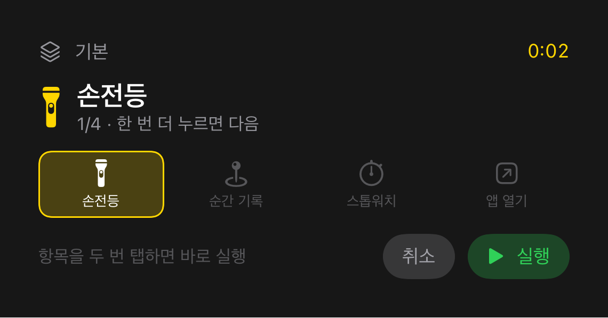
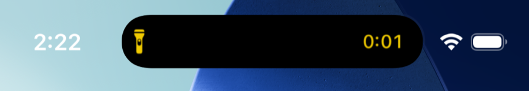
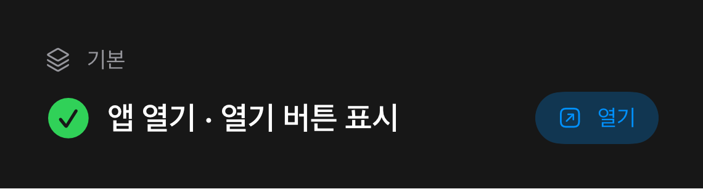
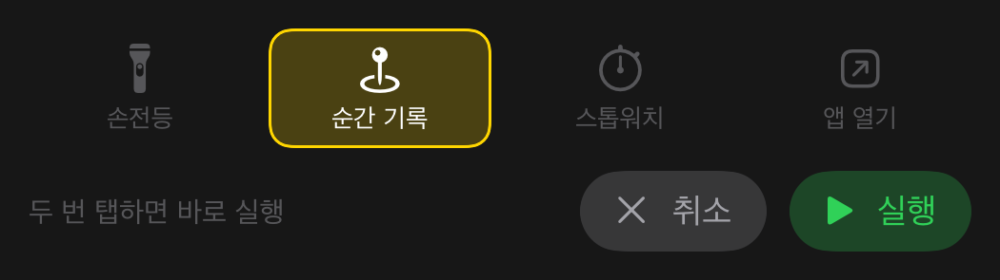

# Cue

액션 버튼 한 번으로 여러 액션을 순환하고, **무엇이 실행될지를 다이나믹 아일랜드로 보여주는** iOS 앱.

*[English](README.md) · 설계 근거: [DESIGN.ko.md](DESIGN.ko.md)*

<p align="center">
  
</p>

<p align="center">
  
  &nbsp;
  
</p>

| | |
|---|---|
| 최소 버전 | iOS 18.0 (`ControlWidget`) |
| 개발 환경 | Xcode 26.6 / iOS 26.5 SDK / **Swift 6 언어 모드** |
| 액션 버튼 | iPhone 15 Pro 이상 — 시뮬레이터에는 없다 |
| 언어 | 한국어 · 영어 |

## 왜 만들었나

액션 버튼의 가장 큰 불만은 **동작을 하나만** 할당할 수 있다는 것이다. 이걸 푸는 앱은 이미 있다 —
[Action Button Pro](https://apps.apple.com/app/id6471029467), ActionMate,
[MultiButton 단축어](https://www.macstories.net/ios/introducing-multibutton-assign-two-shortcuts-to-the-same-action-button-press-on-iphone-15-pro/).

하지만 **누른 뒤 피드백이 없다.** 눌렸는지, 무엇이 실행됐는지, 다음에 누르면 뭐가 될지 알 수 없다.
Action Button Pro의 App Store 기능 목록을 확인한 결과 Live Activity · 다이나믹 아일랜드 · 제어 센터
컨트롤이 전부 없다(2026-08-07 확인). UI 표면은 잠금화면 위젯과 홈 아이콘 롱프레스뿐이다.

Cue는 그 피드백 레이어가 본체다.

## 동작

```
1번째 누름   ( 🔦 손전등   0:02 )   ← 다이나믹 아일랜드
2번째 누름   ( 📍 순간기록 0:02 )   2초 안에 누르면 다음 항목으로
2초 경과     ( ✓ 실행됨 )
```

다이나믹 아일랜드를 길게 누르면 세트 전체가 펼쳐진다.

<p align="center">
  
</p>

확정 경로는 두 가지다.

| 경로 | 동작 |
|---|---|
| **2초 방치** | 선택된 항목이 자동 실행된다 |
| **항목 더블 탭** | 그 항목이 기다리지 않고 즉시 실행된다 |

첫 탭이 선택을 옮기고 창을 다시 열기 때문에, 아무 항목이나 두 번 탭하면 순환을 거치지 않고 바로
실행된다. 창이 지난 뒤 누르면 처음으로 리셋된다.

잠금화면 카드와 다이나믹 아일랜드 확장 뷰에는 세트 전체가 **탭 가능한 스트립**으로 뜨고
**취소 / 실행** 버튼이 함께 있다. 제어 센터의 두 번째 컨트롤로 세트를 전환한다.

### 액션 종류

백그라운드 인텐트가 실제로 할 수 있는 것만 넣었다. 시스템 카메라 실행이나 무음 전환은 서드파티
API가 없다.

| 종류 | 동작 |
|---|---|
| `torch` | 손전등 토글 (`AVCaptureDevice`) |
| `mark` | 지금 시각을 로그에 남긴다 |
| `stopwatch` | 스톱워치 시작 / 정지 |
| `openApp` | 결과에 **"열기" 버튼**을 붙인다 — 앱을 전면에 올리는 유일한 수단 |
| `openURL` | 같은 방식으로 링크를 연다. **https만** — `OpenURLIntent`가 커스텀 스킴을 거부한다 |

## 빌드

```bash
xcodebuild -project Cue.xcodeproj -scheme Cue -configuration Debug \
  -destination 'platform=iOS Simulator,name=iPhone 17 Pro' build
```

시뮬레이터에는 액션 버튼이 없다. 앱 안의 **"Cue 누르기"** 버튼이나 단축어 앱으로 같은 인텐트를
실행해 확인한다.

실기기에 올리려면 Xcode에서 **팀을 지정**하고 App Group을 프로비저닝해야 한다.

## 테스트

```bash
xcodebuild test -project Cue.xcodeproj -scheme Cue \
  -destination 'platform=iOS Simulator,name=iPhone 17 Pro'
```

| 층 | 개수 | 소요 | 무엇 |
|---|---|---|---|
| 단위 · 뷰 렌더 (Swift Testing) | 46 | 약 3초 | 상태 기계 32 + 뷰 14 |
| 통합 스모크 (XCUITest) | 5 | 약 70초 | 배선 · 현지화, ko·en 각각 |

경고 0건. 두 층 모두 2회 연속 통과.

뷰 렌더 층은 실효가 확인됐다. 가드를 일시적으로 제거해 실제 크래시를 되살렸더니 테스트가
`Fatal error: Range requires lowerBound <= upperBound`로 죽었다.
[DESIGN.ko.md](DESIGN.ko.md#뷰-렌더-테스트) 참조.

## 무엇이 검증됐고 무엇이 안 됐나

iPhone 17 Pro 시뮬레이터에서 확인: 순환, 2초 자동 커밋, **자동 커밋보다 앞서는 더블 탭 확정**
(첫 탭 후 0.668초에 두 번째 탭 → 0.546초 뒤 이미 완료, 2.0초 시점보다 앞섬), Live Activity ·
다이나믹 아일랜드 렌더링, "열기" 버튼이 실제로 앱을 전면에 올리는 것, 영어 현지화, Swift 6 경고 0건.

**미검증 — 실기기가 필요하다:**

- 액션 버튼 실제 누름
- `Task.sleep(2s)` 커밋이 실기기 백그라운드에서 버티는지 — 이 설계의 가장 약한 고리이고,
  시뮬레이터는 제약이 훨씬 느슨하다
- 제어 센터 · 액션 버튼 갤러리에 컨트롤이 뜨는지
- 촉각 피드백과 손전등 — 시뮬레이터에 햅틱 엔진도 토치도 없다

전체 표는 [DESIGN.ko.md](DESIGN.ko.md#검증-현황)에 있다.

## 설계 근거

[DESIGN.ko.md](DESIGN.ko.md)가 담고 있는 것:

- 순환과 더블 탭을 어떻게 갈라내는가, `generation`이 왜 단조 증가 무효화 토큰인가
- 커밋 대기 — 이 설계의 가장 약한 고리
- 여는 일을 왜 별도 인텐트로 분리했는가
- Swift 6 동시성 격리
- 로컬라이제이션 함정, UI 자동화 손잡이, 테스트 계층
- 검증 현황 표, 알려진 제약, 다음에 할 일

## 이미지

`app.png`·`dynamic-island-compact.png`는 시뮬레이터 **실제 스크린샷**이다. 나머지 카드 이미지는
프로덕션 뷰(`CueActivityViews.swift`)를 `ImageRenderer`로 직접 렌더한 것이다 — 잠금화면
스크린샷에는 iOS의 Live Activity 승인 프롬프트가 겹치고, 카드가 몇 초만 살아 있다. 같은 뷰 ·
같은 상태이므로 화면과 일치한다.
